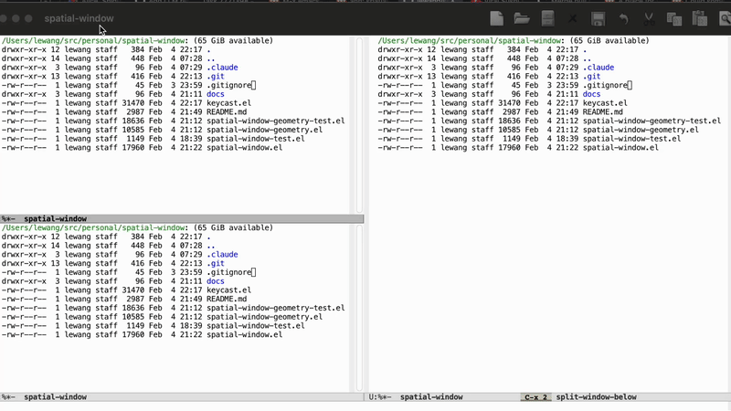

# spatial-window.el

Jump to Emacs windows by pressing keys that match their spatial position on your keyboard.



## Installation

Requires Emacs 27.1+ and [posframe](https://github.com/tumashu/posframe).

### Elpaca

```elisp
(use-package spatial-window
  :ensure (:host github :repo "lewang/spatial-window")
  :bind ("M-o" . spatial-window-select))
```

### Manual

```elisp
(require 'spatial-window)
(global-set-key (kbd "M-o") #'spatial-window-select)
```

## Usage

Press your keybinding to show overlays in each window displaying which keys will select it. Press a key to jump to
that window.

```
+------------------+------------------+
|  q w e r t       |       y u i o p  |
|  a s d f g       |       h j k l ;  |
|  z x c v b       |       n m , . /  |
+------------------+------------------+
```

### Prefix Actions

With `C-u` prefix, you can kill or swap windows:

| Key | Action | Description |
|-----|--------|-------------|
| `k` | Kill | Select one window to delete |
| `K` | Multi-kill | Select multiple windows, `RET` to delete all |
| `s` | Swap | Exchange buffers between two windows |

Examples:
- `C-u M-o k` then press a key to kill that window
- `C-u M-o K` then press keys to toggle selection, `RET` to kill selected
- `C-u M-o s` swaps immediately if 2 windows, otherwise select target

## Customization

`M-x customize-group RET spatial-window RET`

### Keyboard Layout

Presets: `qwerty` (default), `dvorak`, `colemak`

```elisp
(customize-set-variable 'spatial-window-keyboard-layout 'dvorak)
```

Or define a custom layout:

```elisp
(customize-set-variable 'spatial-window-keyboard-layout
                        '(("1" "2" "3" "4" "5" "6" "7" "8" "9" "0")
                          ("q" "w" "e" "r" "t" "y" "u" "i" "o" "p")
                          ("a" "s" "d" "f" "g" "h" "j" "k" "l" ";")))
```

### Expert Mode

If posframe rendering is slow on your configuration, enable expert mode to hide overlays by default:

```elisp
(customize-set-variable 'spatial-window-expert-mode t)
```

In expert mode, press `C-h` during selection to toggle overlay visibility.

## Alternatives

| Package                                                   | Approach                                                                           |
|-----------------------------------------------------------|------------------------------------------------------------------------------------|
| [ace-window](https://github.com/abo-abo/ace-window)       | Labels windows with sequential chars (1,2,3 or a,b,c). Read label, then press key. |
| [winum](https://github.com/deb0ch/emacs-winum)            | Numbers windows 1-9 in mode-line. Press number to switch.                          |
| [switch-window](https://github.com/dimitri/switch-window) | Large overlay numbers. Visual but requires reading.                                |

**spatial-window**: No labels to read. Look at window → fingers know the key. Keyboard position = screen position.

## License

GPL-3.0
